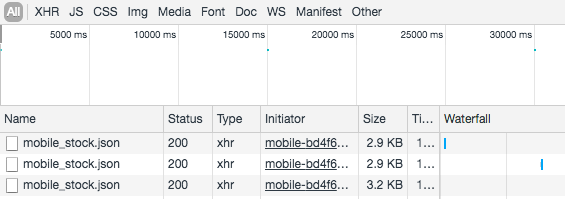
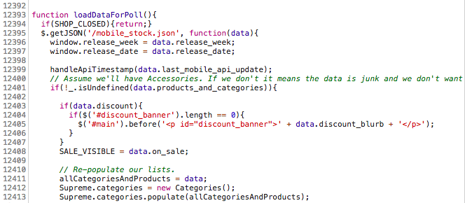
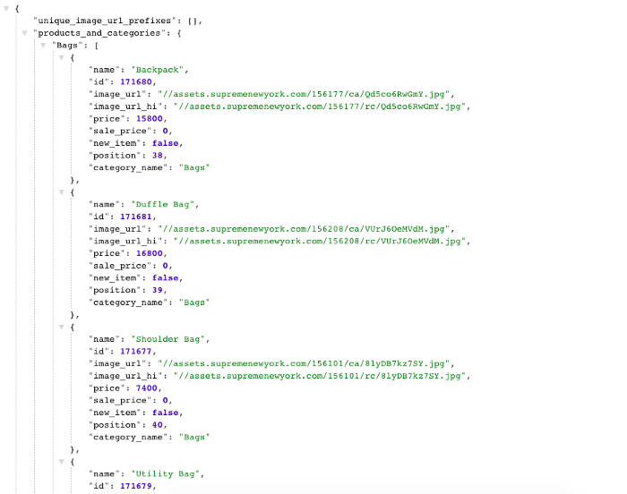
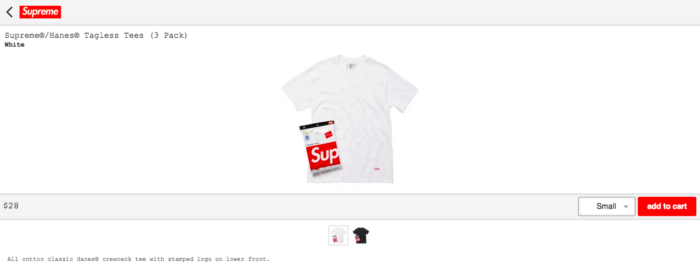
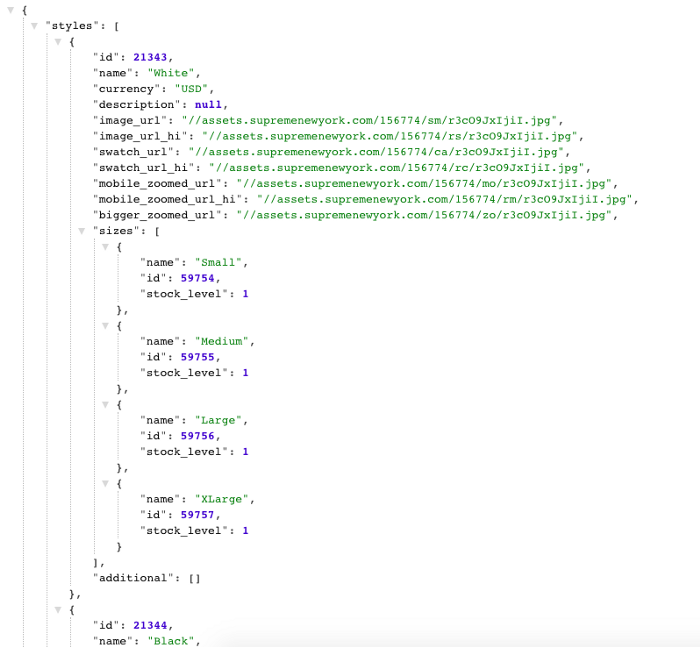

The Supreme bot market has become flooded with bad bots. Bad why? Because they all do the same thing and claim to be better than the next bad bot. How do they work exactly? Good question.

Supreme bots fall under two categories. The first category is a bot that parses the DOM of the Supreme site and automates clicking and typing. The second category is a bot that uses Supreme’s mobile endpoints to fetch and post data. In this article we will be focusing on the second category of Supreme bots.

These bots work in essentially work in 5 steps:
1. Find your item by keyword or some attribute and store its id
2. Use the id to go to the item endpoint and grab its style/sizing id
3. Add to cart
4. Checkout
5. Check if successful

In this part we will only cover the finding of the item and style/sizing information.

# Finding items
It is common knowledge that Supreme updates their US site with new items at 11AM EST every Thursday. Supreme does this by fetching mobile_stock.json every 15 seconds. mobile_stock.json is the private endpoint Supreme uses to fetch and display items on their mobile site. It can be found at http://www.supremenewyork.com/mobile_stock.json. We can find this endpoint by switching to a mobile user-agent and opening up the network tab in your browser’s dev tools while on the Supreme shop page.

One interesting field to note in the network tab is the Initiator. This tells us which script and even which function has made the call to request mobile_stock. Peeking inside the script, you’re able to find a lot of interesting things about the Supreme site. We’re interested in the loadDataForPoll function.

We’re able to visit this endpoint ourselves from the browser. Simply head to the URL and voila.

Immediately, you’re able to view the name, id, image, price, and more of every single item in the shop as JSON. Most languages have JSON parsing libraries, find one of your choice.
products_and_categories is an object that contains every category and its items. We only care about finding our desired item and to do so we have two choices:
1. Iterate through each category then iterate through each item until we find the desired. O(ci)
2. Only iterate through items inside the “new” category. O(i)
Ultimately the choice is yours, option two is limited in that your bot wouldn’t work on restocks but has the advantage of not iterating through as many items. Let’s go with option 2 for simplicity sake.

Keywords can be found by checking the Supreme preview page or by checking EU drop if you’re in the US. Once finding your item, you want to store its id for the other steps.

# Finding the Style + Size

When visiting an item on the Supreme site you’re able to pick your style and sizing information in order to add to cart and checkout. Supreme pulls this information from the item’s endpoint and we’re able to find it using the same technique we used to find the mobile_stock endpoint.

The endpoint follows the following format: https://www.supremenewyork.com/shop/<id>.json
<id> being the id found inside the mobile_stock for the desired item.

Inside the endpoint is an array named “styles” containing all of the style objects for the particular item. Inside each style object we’re able to find the style name, id, image URLs, and a sizes array containing each size name, its id, and whether or not its in currently in stock.

Both the desired item’s style id and the size id are required for checkout so its important that you store these.

You can grab the style id by iterating through the styles until you find an object that has a name field that matches your keyword. The same goes for grabbing the size id.

The names for styles are usually released pre drops by various Supreme news sources and if you’re in US you can usually check the EU style names as they drop first.

The next step is adding to cart which will be covered in part two

Stay tuned