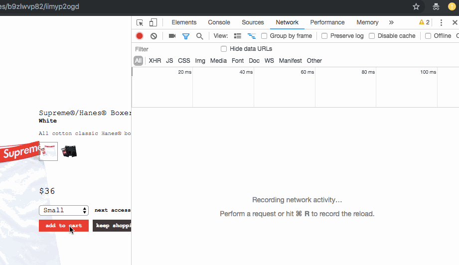
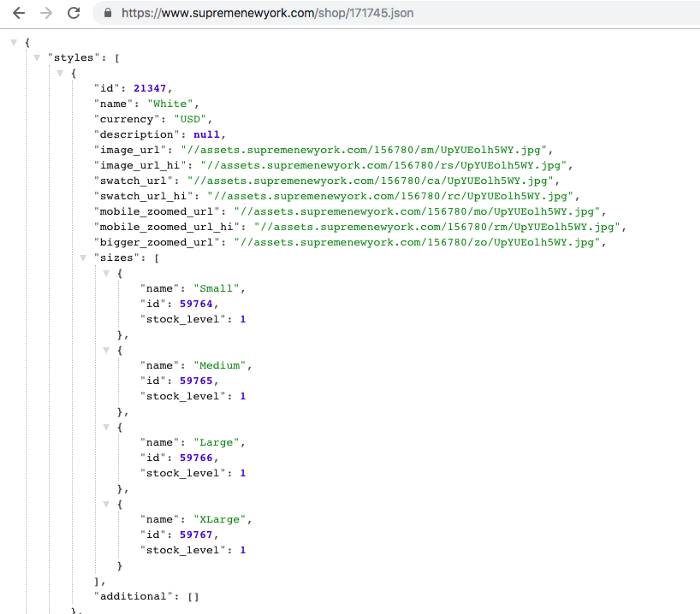
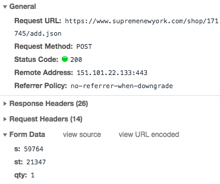
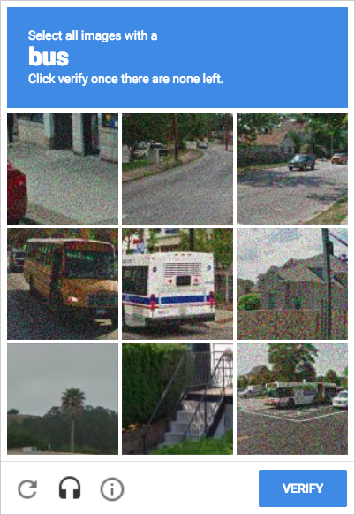
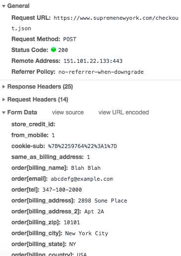

In part 1 we covered how Supreme fetches data from the mobile_stock endpoint. We were able to use this data to fetch our desired item’s id, style id, and sizing id. Our ids are not very useful if we can’t do anything with them. The ultimate goal of a bot is to make it to checkout. Let’s get started on that!

# Add to Cart
How does adding to cart work you ask? Let’s open our network tab and find out.

After clicking the “add to cart” button, Supreme sends a POST request to https://supremenewyork.com/shop/<id>/add

Looking at the form data, we notice fields st and s storing what seems to be IDs. If we check out the item’s json we can find out if this is true.

Looking at our style’s first field we find our id 21347 and under size small we find id 59764. So we send a POST request to the add endpoint with the correct form body and we’re all good right?!

Not exactly.

Opening up the request headers tab we’re able to find an interesting header: x-csrf-token

x-csrf-tokens are used to prevent cross-site request forgery. There has to be an easier way. And there is

# Mobile User-Agents
All endpoints found before have been found with a mobile user-agent. These user-agents are special because they allow the mobile version of the site to be loaded which often lack the security features that the desktop site has.

Using a user-agent switcher we’re able to switch to an iPhone user-agent and POST to the mobile endpoint instead of the desktop.

The form data is essentially the same. We still have a style id and a size id being passed. This time, we also have a qty field. This is the quantity and for most items will be set to 1. Another thing to notice is that the endpoint locations are NOT the same.

If you haven’t noticed already, the mobile endpoints end with .json. You will need to use a mobile user-agent to POST to this endpoint and set the content-type to application/x-www-form-urlencoded

The response from this request is an array containing all the items in your cart and whether or not they’re still in stock. The stock information is used to notify you when an item in your cart has been sold out.

Once you have all your items in cart, it’s time to checkout.
Checkout
At this point, you have two options. If you’re creating a browser extension, you’re able to head to the checkout page and autofill each field. This is what most if not all browser extensions do. Your second option is to do what we’re already doing and POST to the checkout endpoint. Lets view the second option.

After putting in some fake data we’re ready to checkout and find which endpoint is contacted.

Time to process payment *click*

Uh oh, there’s a captcha. Supreme added ReCAPTCHA to their checkout in March 2017 to combat bots. After completing the captcha we’re able to view the request

All of your checkout information gets sent to https://www.supremenewyork.com/checkout.json
Everything here is pretty normal but one thing that may stand out is the cookie-sub . Placing the cooke-sub in a URL decoder shows us what this truly is.

59764 is the size ID for our item and 1 is the quantity. This is stored as JSON and URL encoded to create the cookie-sub.

Let’s see what other fields we have to POST to checkout.json

Oh darn, it’s that captcha response from the puzzle we completed earlier. This is bad because it means we need to complete a captcha for each checkout. Bots have two ways of handling this problem.

One solution is whats called captcha harvesting. The idea is to have the bot user complete captchas while the harvester stores the g-recaptcha-response to use for checkout. dzt’s captcha-harvester is a popular choice.

The second solution is to use a service like DeathByCaptcha or 2captcha to get captchas completed and use the response to checkout. This option is certainly slower than completing puzzles yourself as it can sometimes take up to 7 seconds for one completed puzzle.
Captcha Bypass

A third but risky option is also available, its to not send a g-recaptcha-response in the form data at all. This wouldn’t work on most sites and shouldn’t work on Supreme but apparently the developers are too stupid to check for a valid captcha response server-side.
This is risky because it can get patched at any moment on their side and probably will. Most bots flaunt this around as an amazing “captcha bypass” when all it really is, is luck.

Go wild.

# The Response

The response by the checkout endpoint is returned as JSON and will tell you if errors exist in the form or if you’re in the queue for checkout. In this case, we failed due to an incorrect credit card number. This is useful information to display errors to your user. If all information is correct, you’ll get a status of queued and a slug.

This slug comes in handy because it lets us see whether or not we’ve gotten the items in our cart.

# Checking Status

After the checkout request follows a status.json GET request. https://www.supremenewyork.com/checkout/<slug>/status.json

The response to this is similar to the checkout.json response. Status will returned queued if checkout is still not complete. It will return failed if checkout has failed. Because status changes, it is important to poll this endpoint multiple times. You can choose an interval of your choice. Once every one second is a good place to start.

# Tada!
That’s all there is to it. Supreme bots are not magic and anyone selling you one for $200 is fooling you.

Next part will talk more about anti-botting techniques that Supreme uses and perhaps even the decompiling of some bots to prove that they’re exactly alike.

See you next time